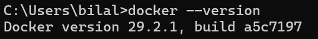
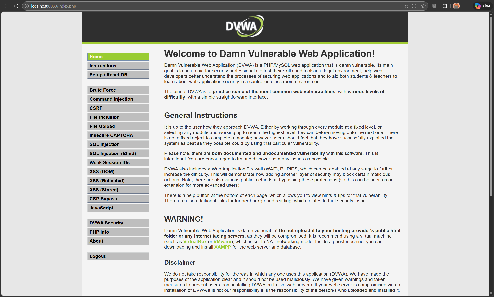
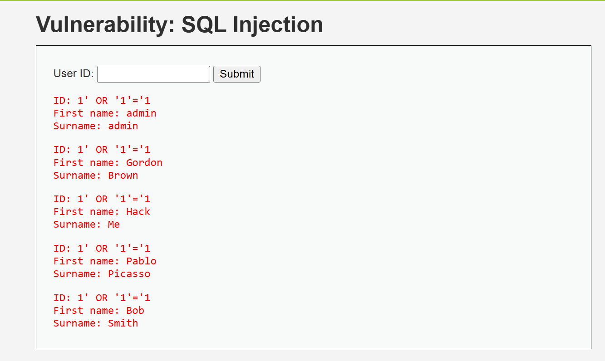
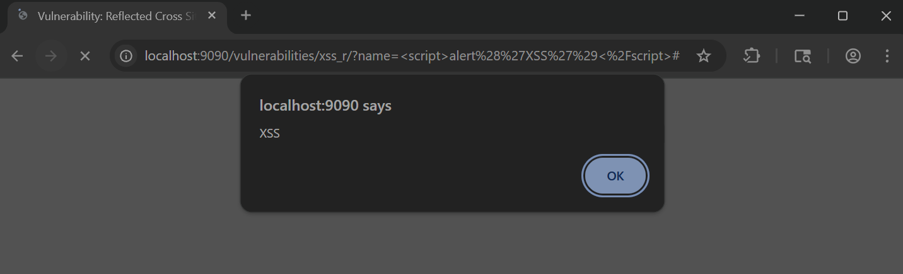
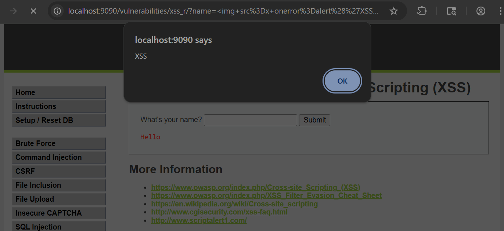
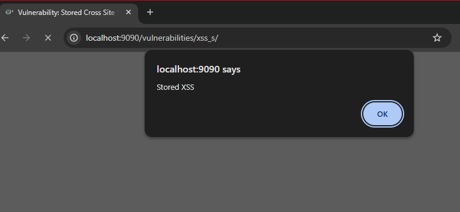
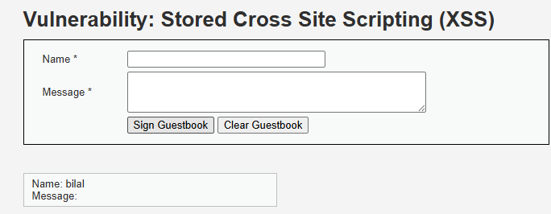
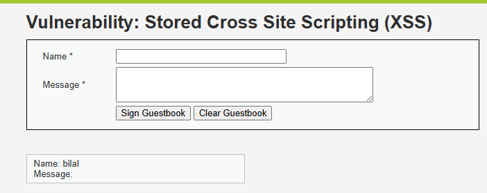

# DVWA Security Lab Report

**Student Name:** Bilal Ahmed

**Student ID:** 08018

**Course:** Cybersecurity: Theory and Tools

**Submission Date:** 1st March 2026

---

## Table of Contents

1. [Install Docker](#1-install-docker)
2. [Deploy DVWA in Docker](#2-deploy-dvwa-in-docker)
3. [Vulnerability Testing](#3-vulnerability-testing)
   - [SQL Injection](#31-sql-injection)
   - [SQL Injection (Blind)](#32-sql-injection-blind)
   - [XSS Reflected](#33-xss-reflected)
   - [XSS Stored](#34-xss-stored)
   - [XSS DOM](#35-xss-dom)
   - [CSRF](#36-csrf)
   - [Command Injection](#37-command-injection)
   - [File Inclusion](#38-file-inclusion)
   - [File Upload](#39-file-upload)
   - [Brute Force](#310-brute-force)
   - [Insecure CAPTCHA](#311-insecure-captcha)
   - [Weak Session IDs](#312-weak-session-ids)
4. [Security Analysis](#4-security-analysis)
5. [OWASP Top 10 Mapping](#5-owasp-top-10-mapping)
6. [Bonus: Nginx + HTTPS](#6-bonus-nginx--https)
7. [Conclusion](#7-conclusion)
8. [GitHub Repository](#8-github-repository)

---

## 1. Install Docker

### Docker Installation

```
Docker version 29.2.1, build a5c7197
```



## 2. Deploy DVWA in Docker

```bash
docker pull vulnerables/web-dvwa
docker run -d --name dvwa -p 8080:80 vulnerables/web-dvwa
```

DVWA is accessible at `http://localhost:8080`. Database initialized via the setup page. Login confirmed with `admin / password`.



---

## 3. Vulnerability Testing

> Security levels tested: **Low**, **Medium**, **High**  
> Level is changed via: DVWA Security tab (bottom-left sidebar)

---

### 3.1 SQL Injection

#### Low

**Payload:**

```sql
1' OR '1'='1
```

**Result:**  
[Describe what happened — all user records returned, etc.]



**Why it worked:**  
[User input is directly concatenated into the SQL query with no escaping or parameterization. Explain the vulnerable query structure.]

---

#### Medium

**Payload / Approach:**  
[Describe the approach — dropdown replaced the text field, Burp Suite interception used, etc.]

```sql
[Paste medium-level payload if used]
```

**Result:**  
[Describe what happened.]


**Analysis:**  
[Explain what changed at Medium — input surface changed, some filtering added, but still exploitable or not.]

---

#### High

**Payload / Approach:**  
[Describe your attempt.]

**Result:**  
[Describe that it failed and why.]


**Defense Mechanism:**  
[DVWA uses PDO prepared statements at High. User input is treated as a literal string and cannot alter the query structure.]

---

| Field | Details |
|---|---|
| Vulnerability | SQL Injection |
| Security Levels Tested | Low, Medium, High |
| Payload | `1' OR '1'='1` |
| Low Result | [Result] |
| Medium Result | [Result] |
| High Result | [Result] |
| OWASP Category | A03:2021 Injection |

---

### 3.2 SQL Injection (Blind)

#### Low

**Payload:**

```sql
1' AND SLEEP(5)--
```

**Result:**  
[Describe the time delay or boolean response observed.]


**Why it worked:**  
[No output is shown but the database still executes the injected query. Explain boolean-based or time-based blind SQLi.]

---

#### Medium

**Payload / Approach:**  
[Describe the approach.]

**Result:**  
[Describe what happened.]


**Analysis:**  
[Explain Medium level changes.]

---

#### High

**Result:**  
[Describe that it failed and why.]


**Defense Mechanism:**  
[Explain prepared statements preventing blind injection.]

---

| Field | Details |
|---|---|
| Vulnerability | SQL Injection (Blind) |
| Security Levels Tested | Low, Medium, High |
| Payload | `1' AND SLEEP(5)--` |
| Low Result | [Result] |
| Medium Result | [Result] |
| High Result | [Result] |
| OWASP Category | A03:2021 Injection |

---

### 3.3 XSS Reflected

#### Low

**Payload:**

```html
<script>alert('XSS')</script>
```

**Result:**  
[Describe the alert popup that appeared.]



**Why it worked:**  
[Input is reflected directly in the response with no sanitization or encoding.]

---

#### Medium

**Payload / Approach:**

```html

```

**Result:**  
[Describe whether the bypass worked.]



**Analysis:**  
[Medium strips `<script>` tags but does not filter other HTML tags. The img onerror bypass works because the filter is not comprehensive.]

---

#### High

**Payload / Approach:**  
[Describe your attempt.]

**Result:**  
[Describe that it failed.]


**Defense Mechanism:**  
[High uses a strict whitelist. Only expected characters pass through. Most HTML tags are rejected outright.]

---

| Field | Details |
|---|---|
| Vulnerability | XSS Reflected |
| Security Levels Tested | Low, Medium, High |
| Payload | `<script>alert('XSS')</script>` |
| Low Result | [Result] |
| Medium Result | [Result] |
| High Result | [Result] |
| OWASP Category | A03:2021 Injection |

---

### 3.4 XSS Stored

#### Low

**Payload:**

```html
<script>alert('Stored XSS')</script>
```

**Result:**  
[Describe that the payload was saved and the alert fires for every visitor.]



**Why it worked:**  
[Input is saved to the database without sanitization and rendered raw on page load for all users.]

---

#### Medium

**Payload / Approach:**  
[Describe the bypass attempt.]

**Result:**  
[Describe what happened.]



**Analysis:**  
[Explain Medium level filtering on stored input.]

---

#### High

**Result:**  
[Describe that it failed.]



**Defense Mechanism:**  
[High encodes special characters on output. The script tags are rendered as plain text, not executed.]

---

| Field | Details |
|---|---|
| Vulnerability | XSS Stored |
| Security Levels Tested | Low, Medium, High |
| Payload | `<script>alert('Stored XSS')</script>` |
| Low Result | [Result] |
| Medium Result | [Result] |
| High Result | [Result] |
| OWASP Category | A03:2021 Injection |

---

### 3.5 XSS DOM

#### Low

**Payload:**

```html

```

**Result:**  
[Describe the alert that fired via DOM manipulation.]


**Why it worked:**  
[Input is written directly into the DOM via JavaScript without sanitization. The browser executes it.]

---

#### Medium

**Payload / Approach:**  
[Describe the bypass attempt.]

**Result:**  
[Describe what happened.]


**Analysis:**  
[Explain Medium DOM-based filtering changes.]

---

#### High

**Result:**  
[Describe that it failed.]


**Defense Mechanism:**  
[Explain High level defense against DOM XSS.]

---

| Field | Details |
|---|---|
| Vulnerability | XSS DOM |
| Security Levels Tested | Low, Medium, High |
| Payload | `` |
| Low Result | [Result] |
| Medium Result | [Result] |
| High Result | [Result] |
| OWASP Category | A03:2021 Injection |

---

### 3.6 CSRF

#### Low

**Approach:**  
Crafted an HTML form that auto-submits a password change request. The browser sends the session cookie automatically.

```html
<form action="http://localhost:8080/vulnerabilities/csrf/" method="GET">
  <input type="hidden" name="password_new" value="hacked">
  <input type="hidden" name="password_conf" value="hacked">
  <input type="hidden" name="Change" value="Change">
</form>
<script>document.forms[0].submit();</script>
```

**Result:**  
[Describe the password change succeeding without user interaction.]


**Why it worked:**  
[No CSRF token is present. Any request with a valid session cookie is accepted regardless of origin.]

---

#### Medium

**Approach:**  
[Describe the Referer header check and whether you attempted to bypass it.]

**Result:**  
[Describe what happened.]


**Analysis:**  
[Medium checks the Referer header. Explain whether this is bypassable and how.]

---

#### High

**Result:**  
[Describe that it failed.]


**Defense Mechanism:**  
[High requires a CSRF token embedded in the form. A forged request from another origin cannot know the token, so the server rejects it.]

---

| Field | Details |
|---|---|
| Vulnerability | CSRF |
| Security Levels Tested | Low, Medium, High |
| Payload | Forged HTML form |
| Low Result | [Result] |
| Medium Result | [Result] |
| High Result | [Result] |
| OWASP Category | A01:2021 Broken Access Control |

---

### 3.7 Command Injection

#### Low

**Payload:**

```
127.0.0.1; ls
```

**Result:**  
[Describe both commands executing — ping and ls output visible.]


**Why it worked:**  
[Input is passed directly to a system shell call. Shell metacharacters like `;` are not stripped.]

---

#### Medium

**Payload / Approach:**

```
127.0.0.1 && ls
```

**Result:**  
[Describe whether the bypass worked.]


**Analysis:**  
[Medium strips some characters like `;` but misses others like `&&`. Explain which ones worked.]

---

#### High

**Result:**  
[Describe that it failed.]


**Defense Mechanism:**  
[High uses a strict character whitelist on input. Shell metacharacters are completely blocked.]

---

| Field | Details |
|---|---|
| Vulnerability | Command Injection |
| Security Levels Tested | Low, Medium, High |
| Payload | `127.0.0.1; ls` |
| Low Result | [Result] |
| Medium Result | [Result] |
| High Result | [Result] |
| OWASP Category | A03:2021 Injection |

---

### 3.8 File Inclusion

#### Low

**Payload:**

```
http://localhost:8080/vulnerabilities/fi/?page=../../etc/passwd
```

**Result:**  
[Describe the /etc/passwd file contents being displayed.]


**Why it worked:**  
[The `page` parameter is passed directly to a PHP include statement with no path restriction.]

---

#### Medium

**Payload / Approach:**  
[Describe the bypass attempt — e.g. double encoding or null byte.]

**Result:**  
[Describe what happened.]


**Analysis:**  
[Medium adds some path restrictions but may still be bypassable. Explain your findings.]

---

#### High

**Result:**  
[Describe that it failed.]


**Defense Mechanism:**  
[High uses a hardcoded allowlist of permitted filenames. Any value outside the allowlist is rejected.]

---

| Field | Details |
|---|---|
| Vulnerability | File Inclusion |
| Security Levels Tested | Low, Medium, High |
| Payload | `../../etc/passwd` |
| Low Result | [Result] |
| Medium Result | [Result] |
| High Result | [Result] |
| OWASP Category | A05:2021 Security Misconfiguration |

---

### 3.9 File Upload

#### Low

**Approach:**  
Uploaded a PHP webshell as a `.php` file with no restrictions.

```php
<?php system($_GET['cmd']); ?>
```

**Result:**  
[Describe the file being accepted and the shell being accessible at its upload path.]


**Why it worked:**  
[No file type validation exists at Low. Any file extension is accepted.]

---

#### Medium

**Approach:**  
[Describe using Burp Suite to intercept and change the Content-Type header from application/x-php to image/jpeg.]

**Result:**  
[Describe whether the bypass worked.]


**Analysis:**  
[Medium checks the MIME type sent in the request header, not the actual file content. Changing the header in Burp bypasses this check.]

---

#### High

**Result:**  
[Describe that it failed.]


**Defense Mechanism:**  
[High inspects the actual file content and extension. A PHP file masquerading as an image is detected and rejected.]

---

| Field | Details |
|---|---|
| Vulnerability | File Upload |
| Security Levels Tested | Low, Medium, High |
| Payload | PHP webshell |
| Low Result | [Result] |
| Medium Result | [Result] |
| High Result | [Result] |
| OWASP Category | A04:2021 Insecure Design |

---

### 3.10 Brute Force

#### Low

**Approach:**  
Used Burp Suite Intruder or Hydra to automate login attempts against `admin`.

```bash
hydra -l admin -P /path/to/wordlist.txt http-get-form \
"localhost/vulnerabilities/brute/:username=^USER^&password=^PASS^&Login=Login:Username and/or password incorrect."
```

**Result:**  
[Describe credentials found and how long it took.]


**Why it worked:**  
[No rate limiting, lockout policy, or delay exists at Low. Requests are processed as fast as they arrive.]

---

#### Medium

**Approach:**  
[Describe your approach at Medium.]

**Result:**  
[Describe what changed — e.g. a delay was added.]


**Analysis:**  
[Explain Medium level changes — e.g. sleep delay added per request, slowing but not stopping brute force.]

---

#### High

**Result:**  
[Describe that automated brute force failed.]


**Defense Mechanism:**  
[High requires a CSRF token that changes with every request. An automated tool cannot retrieve and replay it fast enough, making brute force impractical.]

---

| Field | Details |
|---|---|
| Vulnerability | Brute Force |
| Security Levels Tested | Low, Medium, High |
| Tool Used | Burp Suite Intruder / Hydra |
| Low Result | [Result] |
| Medium Result | [Result] |
| High Result | [Result] |
| OWASP Category | A07:2021 Identification & Authentication Failures |

---

### 3.11 Insecure CAPTCHA

#### Low

**Approach:**  
[Describe how CAPTCHA was bypassed — e.g. parameter manipulation via Burp to skip the CAPTCHA step.]

**Result:**  
[Describe the password change succeeding without solving the CAPTCHA.]


**Why it worked:**  
[CAPTCHA validation is either client-side only or the step parameter can be manipulated to jump directly to the final action without verification.]

---

#### Medium

**Approach:**  
[Describe your approach.]

**Result:**  
[Describe what happened.]


**Analysis:**  
[Explain Medium level change and whether it was still bypassable.]

---

#### High

**Result:**  
[Describe that it failed.]


**Defense Mechanism:**  
[Explain High level server-side CAPTCHA enforcement.]

---

| Field | Details |
|---|---|
| Vulnerability | Insecure CAPTCHA |
| Security Levels Tested | Low, Medium, High |
| Low Result | [Result] |
| Medium Result | [Result] |
| High Result | [Result] |
| OWASP Category | A07:2021 Identification & Authentication Failures |

---

### 3.12 Weak Session IDs

#### Low

**Approach:**  
Clicked "Generate" multiple times and observed the session ID values in the cookie.

**Result:**  
[Describe the sequential IDs observed — 1, 2, 3, etc.]


**Why it worked:**  
[Session IDs are generated using a simple counter. They are predictable, making session hijacking trivial.]

---

#### Medium

**Approach:**  
[Describe your observation at Medium.]

**Result:**  
[Describe whether the IDs improved.]


**Analysis:**  
[Explain Medium level session ID generation — e.g. time-based, still somewhat predictable.]

---

#### High

**Result:**  
[Describe the session ID format at High.]


**Defense Mechanism:**  
[High uses a cryptographically secure random value for session IDs. Brute forcing or predicting them is not feasible.]

---

| Field | Details |
|---|---|
| Vulnerability | Weak Session IDs |
| Security Levels Tested | Low, Medium, High |
| Low Result | [Result] |
| Medium Result | [Result] |
| High Result | [Result] |
| OWASP Category | A07:2021 Identification & Authentication Failures |

---

## 4. Security Analysis

### Q1: Why does SQL Injection succeed at Low security?

[User input is directly concatenated into the SQL query with no escaping or parameterization. Explain the vulnerable query structure and how the payload `1' OR '1'='1` breaks out of the intended query logic.]

### Q2: What control prevents SQL Injection at High?

[DVWA uses PDO prepared statements at High. Explain how parameterized queries work — the query structure is fixed at compile time, and user input is always treated as data, never as code.]

### Q3: Does HTTPS prevent these attacks?

[No. HTTPS encrypts data in transit between the client and server. The attacks covered in this lab — SQLi, XSS, CSRF, command injection — all execute at the application layer, after the server has already decrypted the request. HTTPS has no visibility into application logic. A password sent over HTTPS to a vulnerable login form is still vulnerable to SQLi once the server processes it.]

### Q4: What risks exist if DVWA is deployed publicly?

[Cover the following: remote code execution via file upload, full database read/write via SQL injection, session hijacking via weak session IDs, account takeover via CSRF or brute force, phishing and malware distribution via stored XSS, and use of the compromised server as a pivot point for attacking other internal systems.]

### Q5: Why does security increase at each DVWA level?

[Compare the defense strategies used across levels. Low uses no validation. Medium adds partial input filtering, which is often bypassable. High uses proper defenses — prepared statements, output encoding, CSRF tokens, allowlists. The jump from Medium to High reflects the difference between security theater and actual security controls.]

---

## 5. OWASP Top 10 Mapping

| Vulnerability | OWASP Top 10 Category |
|---|---|
| SQL Injection | A03:2021 Injection |
| SQL Injection (Blind) | A03:2021 Injection |
| XSS Reflected | A03:2021 Injection |
| XSS Stored | A03:2021 Injection |
| XSS DOM | A03:2021 Injection |
| CSRF | A01:2021 Broken Access Control |
| Command Injection | A03:2021 Injection |
| File Inclusion | A05:2021 Security Misconfiguration |
| File Upload | A04:2021 Insecure Design |
| Brute Force | A07:2021 Identification & Authentication Failures |
| Insecure CAPTCHA | A07:2021 Identification & Authentication Failures |
| Weak Session IDs | A07:2021 Identification & Authentication Failures |

---

## 6. Bonus: Nginx + HTTPS

### Nginx Reverse Proxy Setup

[Describe your Nginx configuration. Explain how it listens on port 443 and proxies traffic to the DVWA container on port 8080.]

```nginx
[Paste your nginx.conf here]
```


### Self-Signed Certificate

```bash
openssl req -x509 -nodes -days 365 -newkey rsa:2048 \
  -keyout nginx.key -out nginx.crt
```

[Paste openssl output and describe the certificate details.]


### HTTP vs HTTPS Traffic Comparison

[Describe what you captured in Wireshark. On HTTP you can see plaintext credentials in the packet payload. On HTTPS the payload is encrypted and unreadable.]


---

## 7. Conclusion

[Summarize the key takeaways. What did you observe about how defenses evolve from Low to High? What does the failure of partial fixes at Medium tell you about real-world application hardening? What would you recommend if you were auditing a production application?]

---

## 8. GitHub Repository

**Repository:** [https://github.com/yourusername/dvwa-security-lab](https://github.com/yourusername/dvwa-security-lab)

---

*This lab was performed exclusively on a local machine. No external systems were tested or attacked.*
