# DVWA Security Lab Report

**Student Name:** Bilal Ahmed

**Student ID:** 08018

**Course:** Cybersecurity: Theory and Tools

**Submission Date:** 8th March 2026

---

## Table of Contents

1. [Install Docker](#1-install-docker)
2. [Deploy DVWA in Docker](#2-deploy-dvwa-in-docker)
3. [Vulnerability Testing](#3-vulnerability-testing)
   - [3.1 SQL Injection](#31-sql-injection)
   - [3.2 SQL Injection (Blind)](#32-sql-injection-blind)
   - [3.3 XSS Reflected](#33-xss-reflected)
   - [3.4 XSS Stored](#34-xss-stored)
   - [3.5 XSS DOM](#35-xss-dom)
   - [3.6 CSRF](#36-csrf)
   - [3.7 Command Injection](#37-command-injection)
   - [3.8 File Inclusion](#38-file-inclusion)
   - [3.9 File Upload](#39-file-upload)
   - [3.10 Brute Force](#310-brute-force)
   - [3.11 Insecure CAPTCHA](#311-insecure-captcha)
   - [3.12 Weak Session IDs](#312-weak-session-ids)
4. [Docker Inspection Tasks](#4-docker-inspection-tasks)
5. [Security Analysis](#5-security-analysis)
6. [OWASP Top 10 Mapping](#6-owasp-top-10-mapping)
7. [Conclusion](#7-conclusion)
8. [Bonus: Nginx + HTTPS](#8-bonus-nginx--https)
9. [GitHub Repository](#9-github-repository)

---

## 1. Install Docker

### Docker Installation

```
Docker version 29.2.1, build a5c7197
```


## 2. Deploy DVWA in Docker

```bash
docker pull vulnerables/web-dvwa
docker run -d --name dvwa -p 8080:80 vulnerables/web-dvwa
```

DVWA is accessible at `http://localhost:8080`. Database initialized via the setup page. Login confirmed with `admin / password`.


---

## 3. Vulnerability Testing

> Security levels tested: **Low**, **Medium**, **High**  
> Level is changed via: DVWA Security tab (bottom-left sidebar)

---

### 3.1 SQL Injection

#### Low

**Payload:**

```sql
1' OR '1'='1
```

**Result:**  
All 5 user records were dumped - admin, Gordon Brown, Hack Me, Pablo Picasso, and Bob Smith. The database returned every row because the injected condition `'1'='1` is always true.


**Why it worked:**  
The input is concatenated directly into the SQL query with no sanitization. The resulting query becomes `SELECT * FROM users WHERE id='1' OR '1'='1'` which returns all rows.

---

#### Medium

**Payload:**  
Security level changed to Medium. A dropdown replaced the free text field. Burp Suite was used to intercept the POST request and the `id` parameter was manually changed to `1 OR 1=1` before forwarding.

```sql
1 OR 1=1
```

**Result:**  
All 5 users were still returned. The attack succeeded despite the dropdown restricting the UI, because the server-side query was still vulnerable.


**Analysis:**  
Medium only changes the input surface from a text box to a dropdown. It adds no real server-side protection. Intercepting the request with Burp and modifying the parameter directly bypasses the UI restriction entirely.

---

#### High

**Payload:**  
Input is entered via a separate session popup window. Tried the same payload `1' OR '1'='1`.

**Result:**  
Only one record returned (admin). The injection partially worked but the output was limited to a single row due to a `LIMIT 1` clause added to the query.


**Defense Mechanism:**  
High level uses PDO prepared statements. User input is treated as a literal string and cannot alter the query structure. The `LIMIT 1` clause also restricts output even if injection partially succeeds.

---

| Field | Details |
|---|---|
| Vulnerability | SQL Injection |
| Security Levels Tested | Low, Medium, High |
| Payload | `1' OR '1'='1` / `1 OR 1=1` |
| Low Result | All 5 users dumped |
| Medium Result | All 5 users dumped via Burp interception |
| High Result | Single record returned, full dump prevented |
| OWASP Category | A03:2021 Injection |

---

### 3.2 SQL Injection (Blind)

#### Low

**Payload:** `1' AND 1=1#` and `1' AND 1=2#`

**Result:**
`1' AND 1=1#` returned "User ID exists in the database." Switching to `1' AND 1=2#` returned "User ID is MISSING." The database responds differently to true vs false conditions confirming boolean-based blind injection.


**Why it worked:**
No data is displayed on screen but the query still executes the injected logic. By observing different responses to true vs false conditions we can extract information without ever seeing raw data. This is boolean-based blind SQLi.

---

#### Medium

**Payload:** `1 AND 1=1` via Burp Suite interception

**Result:**
Same true/false behavior confirmed. Intercepted the POST request in Burp, modified the id parameter directly. Server returned exists for true and missing for false.


**Analysis:**
Medium restricts the UI to a dropdown but the server-side query is still unsanitized. Intercepting and modifying the request in Burp bypasses the UI restriction entirely.

---

#### High

**Payload:** `1' AND 1=2#` via cookie input popup

**Result:**
Attack still succeeded. High level moves input to a cookie parameter via a separate popup but does not sanitize it. True condition returned exists, false condition returned missing.


**Defense Mechanism:**
The intended defense was obscuring the input by moving it to a cookie. However the cookie value is still passed unsanitized to the SQL query. Proper prevention requires prepared statements regardless of where input originates.

---

| Field | Details |
|---|---|
| Vulnerability | SQL Injection (Blind) |
| Security Levels Tested | Low, Medium, High |
| Low Payload | `1' AND 1=1#` / `1' AND 1=2#` |
| Medium Payload | `1 AND 1=1` via Burp Suite |
| High Payload | `1' AND 1=1#` via cookie popup |
| Low Result | Boolean response confirmed injection |
| Medium Result | Boolean response confirmed via Burp |
| High Result | Still vulnerable via unsanitized cookie |
| OWASP Category | A03:2021 Injection |

---

### 3.3 XSS Reflected

#### Low

**Payload:** `<script>alert('XSS')</script>`

**Result:**
Alert popup fired with "XSS". The script tag was reflected directly in the page response and executed by the browser.


**Why it worked:**
Input is reflected back in the response with zero sanitization. The browser sees the script tag and executes it immediately.

---

#### Medium

**Payload:** ``

**Result:**
Initial `<script>` payload was stripped and rendered as plain text. The img onerror bypass fired the alert successfully.


**Analysis:**
Medium filters `<script>` tags but does not sanitize other HTML tags. The img onerror attribute executes JavaScript without needing a script tag at all.

---

#### High

**Payload:** ``

**Result:**
Same img onerror bypass worked at High as well. Alert fired successfully. High level did not fully prevent the attack.


**Defense Mechanism:**
High attempts stricter filtering but still fails to block event-based handlers like onerror. Full prevention requires output encoding — converting special characters to HTML entities so the browser never interprets input as code.

---

| Field | Details |
|---|---|
| Vulnerability | XSS Reflected |
| Security Levels Tested | Low, Medium, High |
| Low Payload | `<script>alert('XSS')</script>` |
| Medium Payload | `` |
| High Payload | `` |
| Low Result | Alert fired |
| Medium Result | Script tag stripped, img bypass worked |
| High Result | Still vulnerable via img onerror |
| OWASP Category | A03:2021 Injection |

---

### 3.4 XSS Stored

#### Low

**Payload:** `<script>alert('Stored XSS')</script>` in the Message field

**Result:**
Alert popup fired with "Stored XSS". The script was saved to the database and executed every time the page loaded. Maxlength attribute on the message field was changed via browser inspect to allow the full payload.


**Why it worked:**
Input is saved to the database with no sanitization and rendered raw on every page load. Any user visiting the page triggers the script automatically.

---

#### Medium

**Payload:** ``

**Result:**
Script tags were stripped but the img onerror bypass fired the alert successfully. Payload was stored and executed on page load.


**Analysis:**
Medium filters `<script>` tags on stored input but ignores other HTML tags and event handlers. The img onerror attribute executes JavaScript without a script tag.

---

#### High

**Payload:** ``

**Result:**
Payload was saved but the message field showed empty. No alert fired. High level stripped the entire payload before storing it in the database.


**Defense Mechanism:**
High level sanitizes input before storing it and encodes output before rendering. Special characters are converted to HTML entities so the browser treats them as text, not code.

---

| Field | Details |
|---|---|
| Vulnerability | XSS Stored |
| Security Levels Tested | Low, Medium, High |
| Low Payload | `<script>alert('Stored XSS')</script>` |
| Medium Payload | `` |
| High Payload | `` |
| Low Result | Alert fired on page load |
| Medium Result | Script stripped, img bypass worked |
| High Result | Payload stripped, no execution |
| OWASP Category | A03:2021 Injection |

---

### 3.5 XSS DOM

#### Low

**Payload:** `?default=<script>alert('DOM XSS')</script>` via URL

**Result:**
Alert popup fired. The script was injected directly into the URL parameter and executed by the browser via DOM manipulation.


**Why it worked:**
The page reads the URL parameter and writes it directly into the DOM using JavaScript with no sanitization. The browser executes whatever is injected.

---

#### Medium

**Payload:** `?default=</option></select>`

**Result:**
Alert fired. Closed the existing HTML select element first then injected an img tag with onerror handler to execute JavaScript.


**Analysis:**
Medium blocks direct script tags but does not account for HTML element breakout. By closing the select and option tags first, the injected img tag lands outside the expected context and executes.

---

#### High

**Payload:** `?default=</option>  </select>`

**Result:**
No alert fired. High level blocked all payloads attempted.


**Defense Mechanism:**
High level uses a strict whitelist of allowed values for the default parameter. Only predefined language values are accepted. Anything outside that list is rejected before it reaches the DOM.

---

| Field | Details |
|---|---|
| Vulnerability | XSS DOM |
| Security Levels Tested | Low, Medium, High |
| Low Payload | `?default=<script>alert('DOM XSS')</script>` |
| Medium Payload | `?default=</option></select>` |
| High Payload | `?default=</option></select>` |
| Low Result | Alert fired via direct URL injection |
| Medium Result | Alert fired via HTML breakout and img onerror |
| High Result | Payload blocked by whitelist |
| OWASP Category | A03:2021 Injection |

---

### 3.6 CSRF

#### Low

**Payload:** Forged HTML form that auto-submits a password change request

```html
<html>
  <body>
    <form action="http://localhost:9090/vulnerabilities/csrf/" method="GET">
      <input type="hidden" name="password_new" value="hacked">
      <input type="hidden" name="password_conf" value="hacked">
      <input type="hidden" name="Change" value="Change">
    </form>
    <script>document.forms[0].submit();</script>
  </body>
</html>
```

**Result:**
Password changed successfully without any user interaction. The server accepted the forged request because no token was required.


**Why it worked:**
No CSRF token exists at Low level. Any request with a valid session cookie is accepted regardless of where it originated.

---

#### Medium

**Payload:** Stored XSS used to inject a forged request from within DVWA itself

```

```

**Result:**
Attack succeeded. Burp HTTP History confirmed the CSRF request fired from within DVWA, bypassing the Referer header check.


**Analysis:**
Medium checks the Referer header to confirm the request came from DVWA. Serving the forged request via Stored XSS makes it originate from DVWA itself, satisfying the check.

---

#### High

**Payload:** Same Stored XSS img src injection attempt

**Result:**
Attack failed. No CSRF request appeared in Burp HTTP History. High level blocked the forged request.


**Defense Mechanism:**
High level requires a valid CSRF token embedded in every form submission. The token is unique per session and per request. A forged request from any origin cannot know the token, so the server rejects it.

---

| Field | Details |
|---|---|
| Vulnerability | CSRF |
| Security Levels Tested | Low, Medium, High |
| Low Payload | Forged HTML form via local file |
| Medium Payload | Stored XSS img src injection |
| High Payload | Stored XSS img src injection |
| Low Result | Password changed successfully |
| Medium Result | Attack succeeded via XSS bypass |
| High Result | Blocked by CSRF token requirement |
| OWASP Category | A01:2021 Broken Access Control |

---

### 3.7 Command Injection

#### Low

**Payload:** `127.0.0.1; ls`

**Result:**
Ping ran successfully then ls listed the directory contents — help, index.php, source. Both commands executed.


**Why it worked:**
Input is passed directly to a system shell call with no sanitization. The semicolon separates two commands and the shell executes both.

---

#### Medium

**Payload:** `127.0.0.1 | ls`

**Result:**
Semicolon and && were stripped but the pipe character was not filtered. Directory listing returned successfully.


**Analysis:**
Medium strips some shell metacharacters like `;` and `&&` but misses the pipe `|` operator. The filter is incomplete and bypassable.

---

#### High

**Payload:** `127.0.0.1|ls`

**Result:**
Attack succeeded. Removing the space before the pipe bypassed the High level filter. Directory listing returned.


**Defense Mechanism:**
High level attempts to block pipe and other metacharacters but the filter checks for ` | ` with spaces. Removing the space bypasses the check entirely. Proper defense requires a strict input whitelist allowing only valid IP address characters.

---

| Field | Details |
|---|---|
| Vulnerability | Command Injection |
| Security Levels Tested | Low, Medium, High |
| Low Payload | `127.0.0.1; ls` |
| Medium Payload | `127.0.0.1 \| ls` |
| High Payload | `127.0.0.1\|ls` |
| Low Result | Both commands executed |
| Medium Result | Pipe bypass worked |
| High Result | No-space pipe bypass worked |
| OWASP Category | A03:2021 Injection |

---

### 3.8 File Inclusion

#### Low

**Payload:** `http://localhost:9090/vulnerabilities/fi/?page=../../../../../../etc/passwd`

**Result:**
Full contents of /etc/passwd exposed. All system user accounts including root, daemon, mysql and others were visible at the top of the page.


**Why it worked:**
The page parameter is passed directly to a PHP include statement with no path restriction. Traversing up the directory tree with ../../ reaches the filesystem root and includes any file.

---

#### Medium

**Payload:** `....//....//....//etc/passwd`

**Result:**
Page returned empty. Medium level blocked the path traversal attempt.


**Analysis:**
Medium strips `../` from the input. The double dot slash bypass `....//` attempts to survive that strip but the filter at Medium level was sufficient to block it.

---

#### High

**Payload:** `file:///etc/passwd`

**Result:**
Full /etc/passwd file exposed again. High level blocked directory traversal but did not block the file:// protocol wrapper.


**Defense Mechanism:**
High blocks `../` traversal but fails to restrict PHP stream wrappers like `file://`. Full protection requires validating input against a strict allowlist of permitted filenames only.

---

| Field | Details |
|---|---|
| Vulnerability | File Inclusion |
| Security Levels Tested | Low, Medium, High |
| Low Payload | `../../../../../../etc/passwd` |
| Medium Payload | `....//....//....//etc/passwd` |
| High Payload | `file:///etc/passwd` |
| Low Result | /etc/passwd fully exposed |
| Medium Result | Blocked |
| High Result | /etc/passwd exposed via file:// wrapper |
| OWASP Category | A05:2021 Security Misconfiguration |

---

### 3.9 File Upload

#### Low

**Approach:**
Uploaded a PHP webshell as a `.php` file with no restrictions.

```php
<?php $c=$_GET['c'];echo `$c`; ?>
```

**Result:**
File uploaded successfully. Visiting `http://localhost:9090/hackable/uploads/shell.php?c=ls` executed the command and returned directory contents confirming remote code execution.


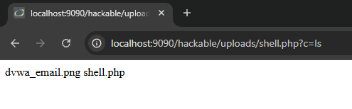

**Why it worked:**
No file type validation exists at Low. Any file extension is accepted and PHP files are executed directly by the server.

---

#### Medium

**Approach:**
Uploaded the same PHP webshell via Burp Suite. Intercepted the request and changed the Content-Type header from `application/x-php` to `image/jpeg` while keeping the `.php` extension.

**Result:**
Upload succeeded. Shell was accessible at the same URL and executed commands successfully.


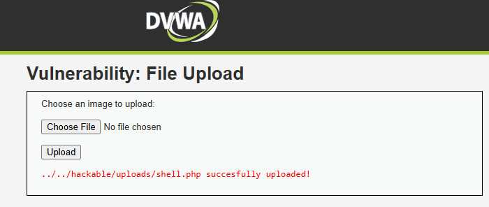

**Analysis:**
Medium checks the Content-Type header sent in the request, not the actual file content. Changing the header in Burp to image/jpeg while keeping the .php extension bypassed the check entirely.

---

#### High

**Approach:**
Attempted direct upload of `shell.php` without any modification.

**Result:**
Upload rejected with "Your image was not uploaded. We can only accept JPEG or PNG images."


**Defense Mechanism:**
High inspects the actual file extension and content, not just the Content-Type header. A PHP file cannot be disguised as an image at this level.

---

| Field | Details |
|---|---|
| Vulnerability | File Upload |
| Security Levels Tested | Low, Medium, High |
| Low Payload | PHP webshell uploaded directly |
| Medium Payload | PHP webshell with spoofed Content-Type via Burp |
| High Payload | Direct upload attempt |
| Low Result | Remote code execution confirmed |
| Medium Result | Content-Type bypass worked, RCE confirmed |
| High Result | Upload blocked |
| OWASP Category | A04:2021 Insecure Design |

### 3.10 Brute Force

#### Low

**Approach:**
Used Burp Suite Intruder to brute force the password field. Sent the login request from HTTP History to Intruder, set the password as the payload position, and ran a small wordlist.

**Result:**
Password "password" returned a longer response length confirming successful login. "Welcome to the password protected area" visible in the response.


**Why it worked:**
No rate limiting, lockout policy, or delay exists at Low. Requests are processed as fast as they arrive making automated attacks trivial.

---

#### Medium

**Approach:**
Same Burp Intruder attack at Medium level.

**Result:**
Attack succeeded. Password identified via longer response length. Medium only adds a 2 second delay per request, slowing the attack but not stopping it.


**Analysis:**
A time delay is not a real defense. It slows brute force but any automated tool will simply wait. No lockout or token requirement exists.

---

#### High

**Approach:**
Same Burp Intruder attack at High level.

**Result:**
Attack still succeeded. Password identified via response length difference.


**Defense Mechanism:**
High level was expected to require a CSRF token making automation harder. However the attack still worked via Burp Intruder which handles the token automatically. True protection requires account lockout after a set number of failed attempts combined with CSRF tokens.

---

| Field | Details |
|---|---|
| Vulnerability | Brute Force |
| Security Levels Tested | Low, Medium, High |
| Tool Used | Burp Suite Intruder |
| Low Result | Password found, no rate limiting |
| Medium Result | Password found, delay only slowed attack |
| High Result | Password found, no effective lockout |
| OWASP Category | A07:2021 Identification & Authentication Failures |

---

### 3.11 Insecure CAPTCHA

#### Module Status: Non-Functional

**Reason:**
The CAPTCHA module requires a Google reCAPTCHA API key configured in `/var/www/html/config/config.inc.php`. This key was not present in the DVWA Docker setup, so the module displayed the error "reCAPTCHA API key missing" across all security levels.

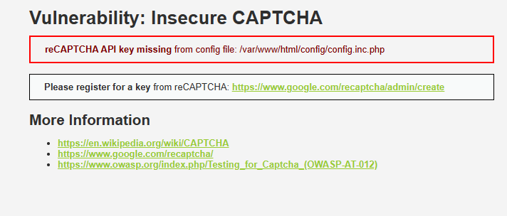

---

#### Expected Behavior (Theoretical Analysis)

#### Low

**Approach:**
Parameter manipulation via Burp Suite. Intercept the password change request and change `step=1` to `step=2` to skip CAPTCHA validation entirely.

**Why it would work:**
Low level validates CAPTCHA only at step 1. Jumping directly to step 2 bypasses the check entirely since no server-side verification exists for the step value.

---

#### Medium

**Approach:**
Intercept request and add `passed_captcha=true` as a POST parameter alongside changing the step value.

**Why it would work:**
Medium checks for a `passed_captcha` parameter. Since it trusts client-supplied values, simply adding it to the request tricks the server into thinking CAPTCHA was solved.

---

#### High

**Expected Result:**
Attack would fail. High level performs server-side verification with Google's reCAPTCHA API. The server sends the CAPTCHA response token to Google directly for validation. A forged or missing token gets rejected.

---

| Field | Details |
|---|---|
| Vulnerability | Insecure CAPTCHA |
| Security Levels Tested | Low, Medium, High |
| Module Status | Non-functional, missing reCAPTCHA API key |
| Low Result | Not testable, theoretical bypass via step manipulation |
| Medium Result | Not testable, theoretical bypass via passed_captcha parameter |
| High Result | Not testable, server-side validation expected |
| OWASP Category | A07:2021 Identification & Authentication Failures |

---

### 3.12 Weak Session IDs

#### Low

**Approach:**
Clicked Generate multiple times and observed the Set-Cookie header in Burp response tab.

**Result:**
Session IDs were sequential integers — 6, 7, 8... incrementing by 1 each click. Completely predictable. An attacker knowing one session ID can guess all others.


**Why it worked:**
Session IDs are generated using a simple counter. Any attacker who knows one valid session ID can predict all others and hijack any active session trivially.

---

#### Medium

**Approach:**
Same observation at Medium via Burp response tab.

**Result:**
Session IDs changed to Unix timestamps — 1772951595, 1772951596. Different format but still predictable since the current time is publicly known.


**Analysis:**
Medium improves on sequential IDs by using timestamps but timestamps are not random. An attacker can narrow down valid session IDs by approximating when a user logged in.

---

#### High

**Approach:**
Same observation at High via Burp response tab.

**Result:**
Session ID was an MD5 hash — c51ce410c124a10e0db5e4b97fc2af39. Not sequential or time-based, significantly harder to predict.


**Defense Mechanism:**
High level hashes the session ID with MD5 making it non-predictable at a glance. However MD5 is a weak algorithm. Production systems should use cryptographically secure random generators, not hashed counters.

---

| Field | Details |
|---|---|
| Vulnerability | Weak Session IDs |
| Security Levels Tested | Low, Medium, High |
| Low Result | Sequential integers, fully predictable |
| Medium Result | Unix timestamps, still predictable |
| High Result | MD5 hash, not easily predictable |
| OWASP Category | A07:2021 Identification & Authentication Failures |

---

## 4: Docker Inspection Tasks

### 4.1 Docker ps

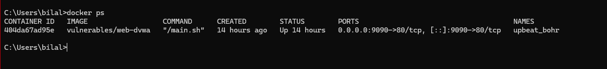

The container is named `upbeat_bohr`, running the `vulnerables/web-dvwa` image. Port 9090 on the host maps to port 80 inside the container.

---

### 4.2 Docker inspect

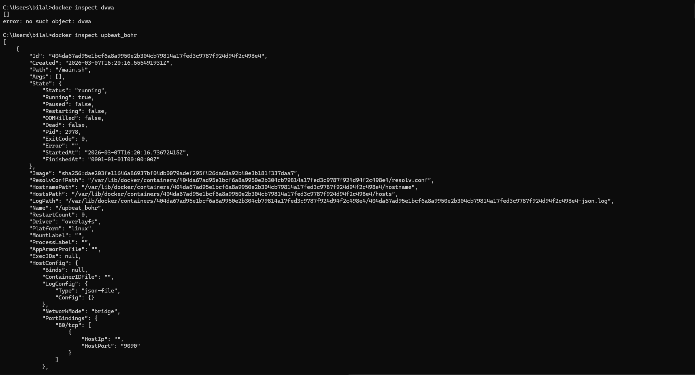

Key findings from the inspect output:

- **Image:** `vulnerables/web-dvwa`
- **Container ID:** `404da67ad95e`
- **IP Address:** `172.17.0.2` (bridge network)
- **Port Binding:** `0.0.0.0:9090 -> 80/tcp`
- **Network Mode:** bridge
- **AutoRemove:** true (container deletes itself on stop)
- **Entrypoint:** `/main.sh` (starts Apache and MariaDB)

---

### 4.3 Docker logs

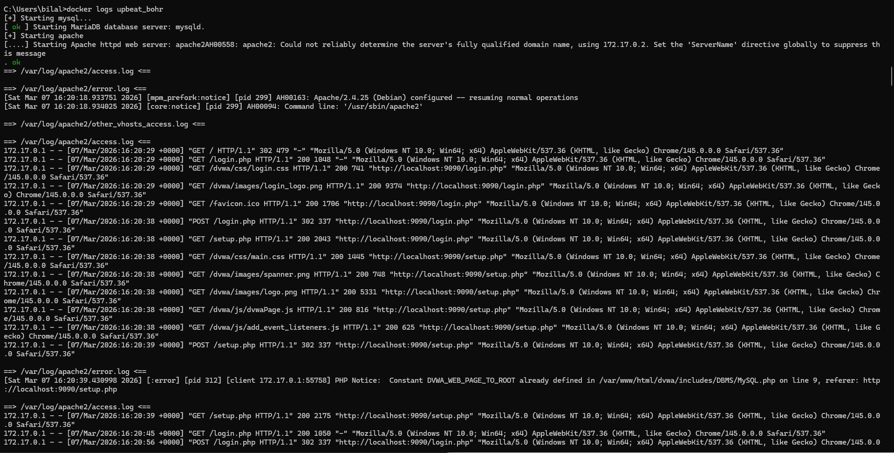

The logs confirm:

- MariaDB started successfully
- Apache 2.4.25 (Debian) started on port 80
- All HTTP requests from the testing session are logged with timestamps, source IP, HTTP method, endpoint, and status codes
- PHP errors are visible, including the `HTTP_REFERER` notice from CSRF Medium and `include()` failures from File Inclusion Medium

---

### 4.4 Docker exec - Container Shell Access

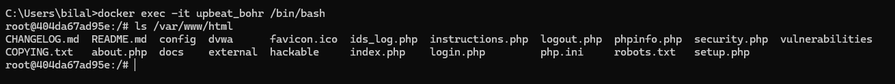

```
docker exec -it upbeat_bohr /bin/bash
root@404da67ad95e:/# ls /var/www/html
```

**Output:**

```
CHANGELOG.md  README.md  config  dvwa  external  hackable
ids_log.php   index.php  login.php  logout.php  phpinfo.php
robots.txt  security.php  setup.php  vulnerabilities
```

---

### 4.5 Explanations

**Where application files are stored**

All DVWA application files live inside the container at `/var/www/html`. The `vulnerabilities/` directory holds the 12 exploit modules. The `hackable/uploads/` directory is where uploaded files (like the PHP web shell) get stored. The `config/` directory holds the database connection settings.

**What backend technology DVWA uses**

DVWA runs on a LAMP stack: Linux (Debian), Apache 2.4.25, MariaDB, and PHP. The web application itself is written in PHP. The database stores user accounts and application data. Apache serves all requests and logs them to `/var/log/apache2/`.

**How Docker isolates the environment**

Docker isolates DVWA using Linux namespaces and cgroups. The container has its own network namespace with a private IP (`172.17.0.2`) on the Docker bridge network, separate from the host's network stack. The filesystem is isolated using OverlayFS, so any changes inside the container (uploaded shells, modified files) do not affect the host. The container runs as its own process tree with PID isolation. Only port 9090 is explicitly exposed to the host, meaning no other container ports are accessible from outside.

---

## 5: Security Analysis

### Q1: Why does SQL Injection succeed at Low security?

At Low, DVWA passes user input directly into the SQL query with no sanitization. The vulnerable query looks like this:

```sql
SELECT * FROM users WHERE user_id = '$id';
```

When I entered `1' OR '1'='1`, the query became:

```sql
SELECT * FROM users WHERE user_id = '1' OR '1'='1';
```

The single quote closes the `user_id` string early. The `OR '1'='1'` condition is always true, so the database returns every row in the table. The application never intended to expose all users, but because input was treated as code rather than data, the query logic was completely rewritten by the attacker.

---

### Q2: What control prevents SQL Injection at High?

At High, DVWA uses PDO prepared statements. The query is defined first with a placeholder:

```php
$stmt = $pdo->prepare("SELECT * FROM users WHERE user_id = :id");
$stmt->bindParam(':id', $id);
```

The database receives the query structure and the user input as two separate things. The query is compiled before the input is ever inserted. Whatever the user submits — including quotes, SQL keywords, or comment sequences — the database engine treats it as a literal string value, not executable code. There is no way to break out of the data context because the code context was already fixed. This is why `1' OR '1'='1` at High simply returns no results instead of dumping the table.

---

### Q3: Does HTTPS prevent these attacks?

No. HTTPS encrypts the connection between the browser and the server, protecting data from interception in transit. Once the server receives and decrypts the request, HTTPS plays no further role. All of the attacks in this lab operate at the application layer, after decryption has already happened.

A SQL injection payload sent over HTTPS arrives at the PHP interpreter in exactly the same form as one sent over HTTP. The same applies to XSS payloads, command injection strings, CSRF requests, and brute force login attempts. The vulnerability is in how the application processes input, not in how the request was delivered. HTTPS solves a transport problem. These are application logic problems.

---

### Q4: What risks exist if DVWA were deployed publicly?

**Remote code execution.** The file upload module at Low and Medium allows uploading a PHP web shell with no real restriction. An attacker gets direct command execution on the server, with the same OS privileges as the web server process.

**Full database compromise.** SQL injection at Low gives read access to every table in the database. With `UNION`-based injection or `sqlmap`, an attacker can dump credentials, emails, and any other stored data. With write privileges, they can modify records or drop tables entirely.

**Account takeover.** Brute force at all three levels cracked the admin password using a short wordlist. Weak session IDs at Low are sequential integers, meaning an attacker watching their own session cookie can enumerate other active sessions. CSRF at Low and Medium allows password changes without any user interaction.

**Stored XSS as a persistent threat.** A payload injected into the guestbook at Low fires for every user who loads the page. This enables session cookie theft, credential harvesting pages, or malware distribution at scale, affecting every visitor until the payload is manually removed.

**Lateral movement.** A compromised server on a corporate network becomes a foothold. Command injection gives shell access, from which an attacker can scan internal subnets, access internal services, or exfiltrate data that is never exposed to the internet directly.

---

### Q5: Why does security increase at each DVWA level?

At Low, there are no defenses. Input goes directly into SQL queries, shell commands, file paths, and HTML output. The application trusts everything the user sends.

At Medium, basic filtering is added — blacklists that strip or escape specific characters. This stops the most obvious payloads but is consistently bypassable. For SQL injection, the `mysql_real_escape_string()` function stops quote-based attacks but the dropdown still accepts unsanitized integer input via Burp. For command injection, semicolons and `&&` are blocked but the pipe character is not. Medium demonstrates the problem with blacklist-based security: attackers only need to find one character or encoding variant that was not anticipated.

At High, the approach changes entirely. SQL injection is blocked with PDO prepared statements, which make injection structurally impossible rather than just harder. XSS stored is blocked by stripping all HTML tags on input. CSRF is blocked with per-session tokens that cannot be forged from a cross-origin request. Command injection is blocked with a strict allowlist that accepts only valid IP address formats.

The pattern across all three levels shows that security comes from correct design, not from adding filters on top of vulnerable code. Medium is security theater. High is actual defense
---

## 6: OWASP Top 10 Mapping

| Vulnerability | OWASP Top 10 Category |
|---|---|
| SQL Injection | A03:2021 Injection |
| SQL Injection (Blind) | A03:2021 Injection |
| XSS Reflected | A03:2021 Injection |
| XSS Stored | A03:2021 Injection |
| XSS DOM | A03:2021 Injection |
| CSRF | A01:2021 Broken Access Control |
| Command Injection | A03:2021 Injection |
| File Inclusion | A05:2021 Security Misconfiguration |
| File Upload | A04:2021 Insecure Design |
| Brute Force | A07:2021 Identification & Authentication Failures |
| Insecure CAPTCHA | A07:2021 Identification & Authentication Failures |
| Weak Session IDs | A07:2021 Identification & Authentication Failures |

---

## 7: Conclusion

Testing DVWA across three security levels made one thing clear: the difference between vulnerable and secure code is not about effort, it's about approach.

At Low, every module fell to textbook attacks. No input validation, no output encoding, no access controls. SQL injection dumped the entire user table in seconds. A PHP shell uploaded without resistance gave direct command execution. Stored XSS fired on every page load. The application trusted everything the user sent, and paid for it across the board.

Medium added filters, and those filters failed. Blacklists are inherently incomplete. For every character or pattern blocked, there is usually an encoding variant, an alternate syntax, or an overlooked operator that achieves the same result. The pipe character bypassed command injection filters. The `img onerror` attribute bypassed XSS script tag stripping. Burp Intruder ignored the 2-second brute force delay and cracked the password anyway. Medium demonstrated exactly why "add a filter" is not a security strategy.

High used structural defenses: prepared statements that make SQL injection impossible by design, CSRF tokens that cannot be forged cross-origin, allowlists that reject anything not explicitly permitted. Most High-level modules held. The ones that did not, like XSS Stored, revealed that a single unprotected input field is enough.

If I were auditing a production application, I would start by looking for any place user input touches a SQL query, shell command, file path, or HTML output. I would check whether the application uses parameterized queries consistently, not just in obvious places. I would look for CSRF protection on every state-changing request, not just password changes. I would check session token entropy and rotation on login. And I would treat any file upload endpoint as high-risk by default, verifying that MIME type, extension, and file content are all validated server-side.

The broader takeaway is that most real-world breaches do not require novel techniques. They exploit the same classes of vulnerability demonstrated here, against applications that never moved past Medium.

---

## 8: Bonus: Nginx + HTTPS

### Setup Overview

DVWA was deployed behind an Nginx reverse proxy using Docker Compose. Nginx handles all incoming traffic on ports 8080 (HTTP) and 8443 (HTTPS), forwarding requests to the DVWA container on its internal port 80. The DVWA container has no ports exposed directly to the host.

The docker-compose.yml defines two services: `dvwa` using the `vulnerables/web-dvwa` image with port 80 exposed only internally, and `nginx` using `nginx:alpine` with ports 8080 and 8443 bound to the host.

---

### Nginx Configuration

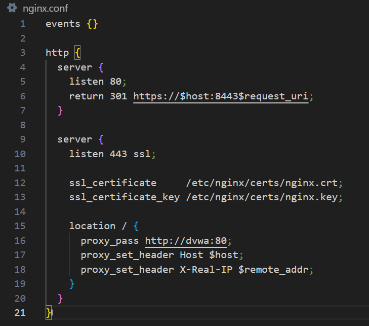

Nginx runs two server blocks. The first listens on port 80 and issues a 301 permanent redirect to HTTPS on port 8443, forcing all HTTP traffic to upgrade. The second listens on port 443 with SSL enabled, loads the self-signed certificate and key from `/etc/nginx/certs/`, and proxies all requests to the DVWA container at `http://dvwa:80` using Docker's internal DNS.

---

### Self-Signed Certificate

```bash
openssl req -x509 -nodes -days 365 -newkey rsa:2048 \
  -keyout certs/nginx.key \
  -out certs/nginx.crt \
  -subj "//C=PK\ST=Sindh\L=Karachi\O=HabibUniversity\CN=localhost"
```

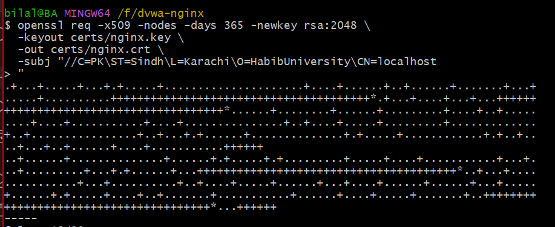

A 2048-bit RSA self-signed certificate was generated using OpenSSL. The certificate is valid for 365 days. Because it is self-signed rather than issued by a trusted CA, browsers display a certificate warning on first visit.

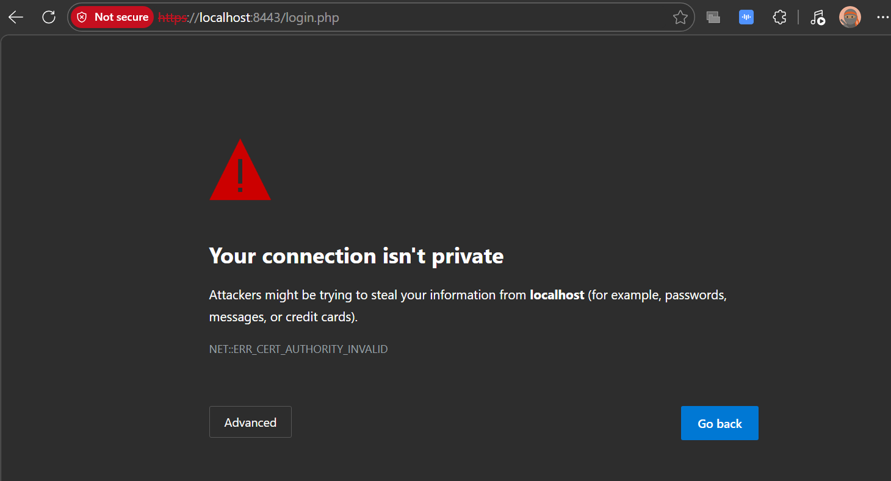

After proceeding past the warning, DVWA loads over HTTPS at `https://localhost:8443`.

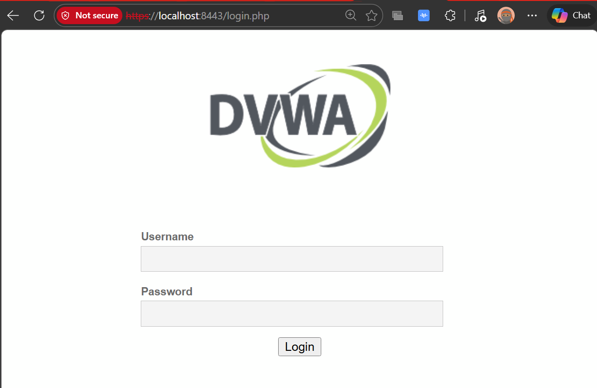

---

### Certificate Details

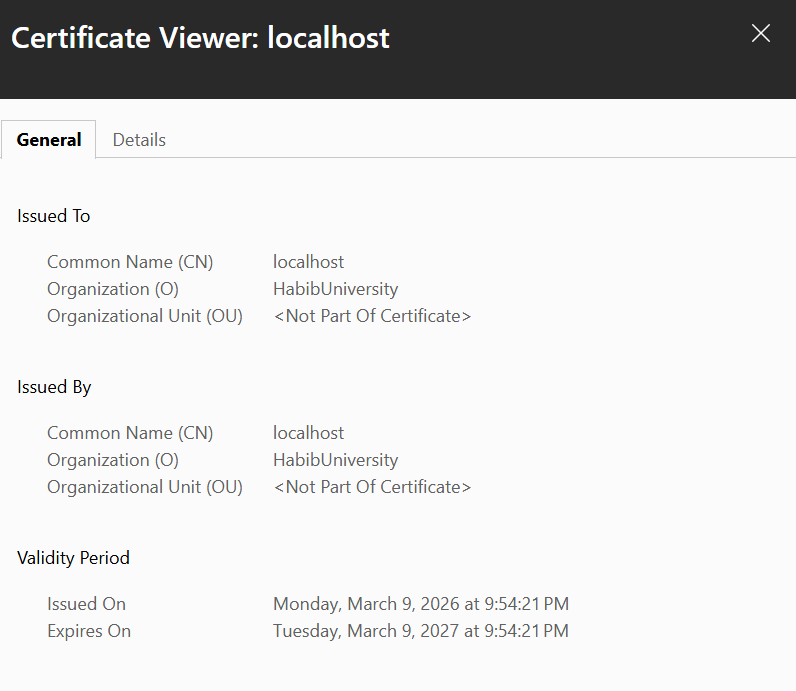

The certificate viewer confirms:

- **Common Name (CN):** localhost
- **Organization (O):** HabibUniversity
- **Issued On:** Monday, March 9, 2026
- **Expires On:** Tuesday, March 9, 2027
- The certificate is self-signed, meaning it was issued by the same entity it was issued to.

---

### HTTP vs HTTPS Traffic Comparison

#### HTTP — Plaintext Credentials Visible

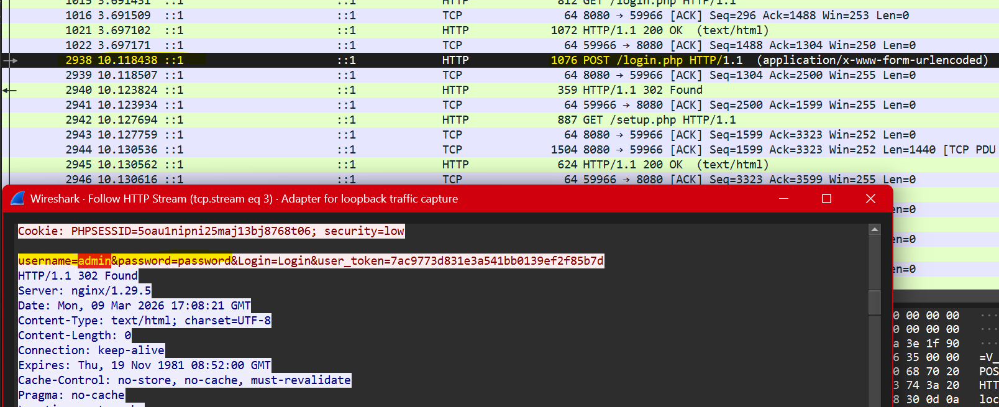

With Nginx configured to proxy HTTP directly on port 8080, a Wireshark capture on the loopback adapter captured the login request in full. Following the HTTP stream shows the POST body in plaintext:

```
username=admin&password=password&Login=Login
```

The credentials, session cookie, and all request headers are fully readable to anyone with access to the network traffic.

#### HTTPS — Traffic Encrypted

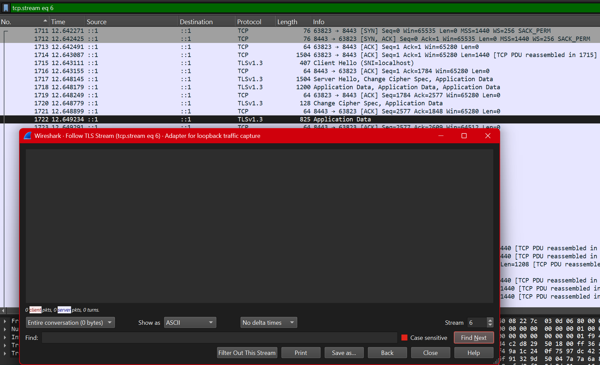

With the 301 redirect restored and HTTPS enforced on port 8443, the same login attempt produces only TLSv1.3 packets. Following the TLS stream returns an empty window — no readable content. The entire HTTP conversation including credentials, cookies, and headers is encrypted inside the TLS tunnel before leaving the browser.

---

### Key Difference

HTTP sends everything in plaintext. A passive observer on the same network captures credentials with no effort. HTTPS wraps the entire session in TLS 1.3, making the payload unreadable without the private key. The Wireshark captures above demonstrate this directly: one shows `username=admin&password=password` in clear text, the other shows nothing.

## 8. GitHub Repository

**Repository:** [https://github.com/bilalahmedss/Application-Security-Testing](https://github.com/bilalahmedss/Application-Security-Testing)

---

*This lab was performed exclusively on a local machine. No external systems were tested or attacked.*
