# DVWA Security Lab Report

**Student Name:** Bilal Ahmed

**Student ID:** 08018

**Course:** Cybersecurity: Theory and Tools

**Submission Date:** 1st March 2026

---

## Table of Contents

1. [Install Docker](#1-install-docker)
2. [Deploy DVWA in Docker](#2-deploy-dvwa-in-docker)
3. [Vulnerability Testing](#3-vulnerability-testing)
   - [SQL Injection](#31-sql-injection)
   - [SQL Injection (Blind)](#32-sql-injection-blind)
   - [XSS Reflected](#33-xss-reflected)
   - [XSS Stored](#34-xss-stored)
   - [XSS DOM](#35-xss-dom)
   - [CSRF](#36-csrf)
   - [Command Injection](#37-command-injection)
   - [File Inclusion](#38-file-inclusion)
   - [File Upload](#39-file-upload)
   - [Brute Force](#310-brute-force)
   - [Insecure CAPTCHA](#311-insecure-captcha)
   - [Weak Session IDs](#312-weak-session-ids)
4. [Security Analysis](#4-security-analysis)
5. [OWASP Top 10 Mapping](#5-owasp-top-10-mapping)
6. [Bonus: Nginx + HTTPS](#6-bonus-nginx--https)
7. [Conclusion](#7-conclusion)
8. [GitHub Repository](#8-github-repository)

---

## 1. Install Docker

### Docker Installation

```
Docker version 29.2.1, build a5c7197
```


## 2. Deploy DVWA in Docker

```bash
docker pull vulnerables/web-dvwa
docker run -d --name dvwa -p 8080:80 vulnerables/web-dvwa
```

DVWA is accessible at `http://localhost:8080`. Database initialized via the setup page. Login confirmed with `admin / password`.


---

## 3. Vulnerability Testing

> Security levels tested: **Low**, **Medium**, **High**  
> Level is changed via: DVWA Security tab (bottom-left sidebar)

---

### 3.1 SQL Injection

#### Low

**Payload:**

```sql
1' OR '1'='1
```

**Result:**  
All 5 user records were dumped - admin, Gordon Brown, Hack Me, Pablo Picasso, and Bob Smith. The database returned every row because the injected condition `'1'='1` is always true.


**Why it worked:**  
The input is concatenated directly into the SQL query with no sanitization. The resulting query becomes `SELECT * FROM users WHERE id='1' OR '1'='1'` which returns all rows.

---

#### Medium

**Payload:**  
Security level changed to Medium. A dropdown replaced the free text field. Burp Suite was used to intercept the POST request and the `id` parameter was manually changed to `1 OR 1=1` before forwarding.

```sql
1 OR 1=1
```

**Result:**  
All 5 users were still returned. The attack succeeded despite the dropdown restricting the UI, because the server-side query was still vulnerable.

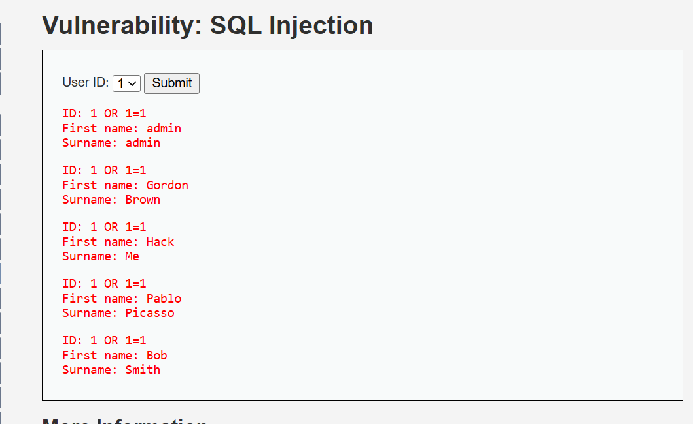

**Analysis:**  
Medium only changes the input surface from a text box to a dropdown. It adds no real server-side protection. Intercepting the request with Burp and modifying the parameter directly bypasses the UI restriction entirely.

---

#### High

**Payload:**  
Input is entered via a separate session popup window. Tried the same payload `1' OR '1'='1`.

**Result:**  
Only one record returned (admin). The injection partially worked but the output was limited to a single row due to a `LIMIT 1` clause added to the query.

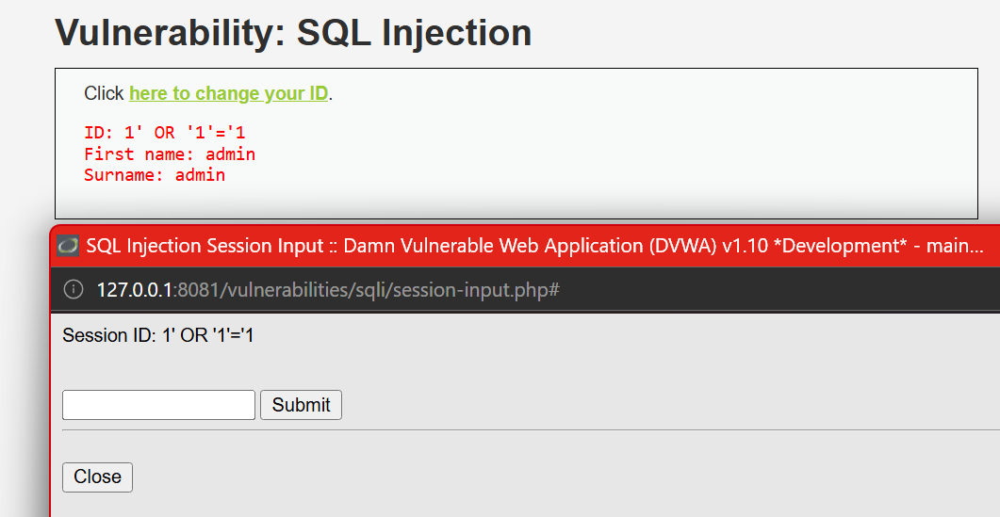

**Defense Mechanism:**  
High level uses PDO prepared statements. User input is treated as a literal string and cannot alter the query structure. The `LIMIT 1` clause also restricts output even if injection partially succeeds.

---

| Field | Details |
|---|---|
| Vulnerability | SQL Injection |
| Security Levels Tested | Low, Medium, High |
| Payload | `1' OR '1'='1` / `1 OR 1=1` |
| Low Result | All 5 users dumped |
| Medium Result | All 5 users dumped via Burp interception |
| High Result | Single record returned, full dump prevented |
| OWASP Category | A03:2021 Injection |

---

### 3.2 SQL Injection (Blind)

#### Low

**Payload:** `1' AND 1=1#` and `1' AND 1=2#`

**Result:**
`1' AND 1=1#` returned "User ID exists in the database." Switching to `1' AND 1=2#` returned "User ID is MISSING." The database responds differently to true vs false conditions confirming boolean-based blind injection.

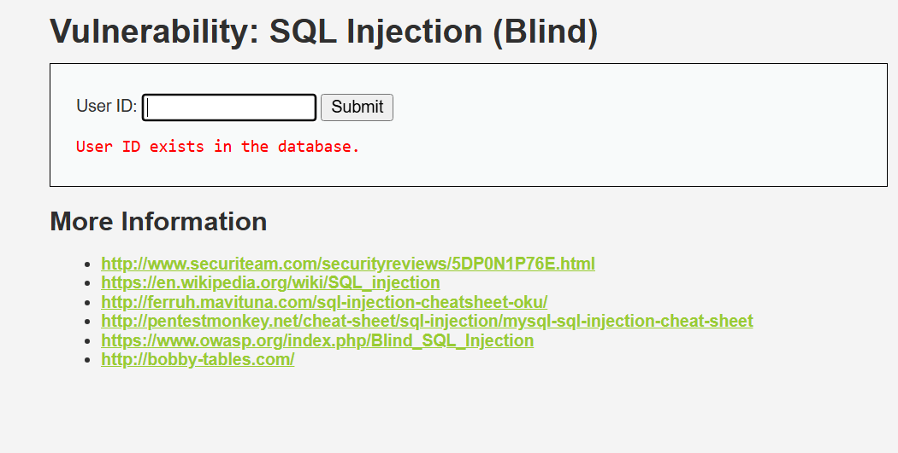

**Why it worked:**
No data is displayed on screen but the query still executes the injected logic. By observing different responses to true vs false conditions we can extract information without ever seeing raw data. This is boolean-based blind SQLi.

---

#### Medium

**Payload:** `1 AND 1=1` via Burp Suite interception

**Result:**
Same true/false behavior confirmed. Intercepted the POST request in Burp, modified the id parameter directly. Server returned exists for true and missing for false.

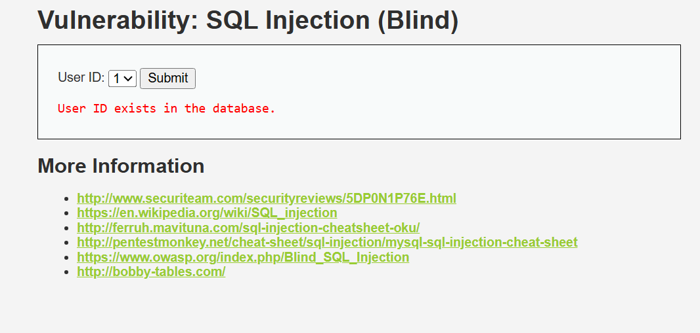

**Analysis:**
Medium restricts the UI to a dropdown but the server-side query is still unsanitized. Intercepting and modifying the request in Burp bypasses the UI restriction entirely.

---

#### High

**Payload:** `1' AND 1=2#` via cookie input popup

**Result:**
Attack still succeeded. High level moves input to a cookie parameter via a separate popup but does not sanitize it. True condition returned exists, false condition returned missing.

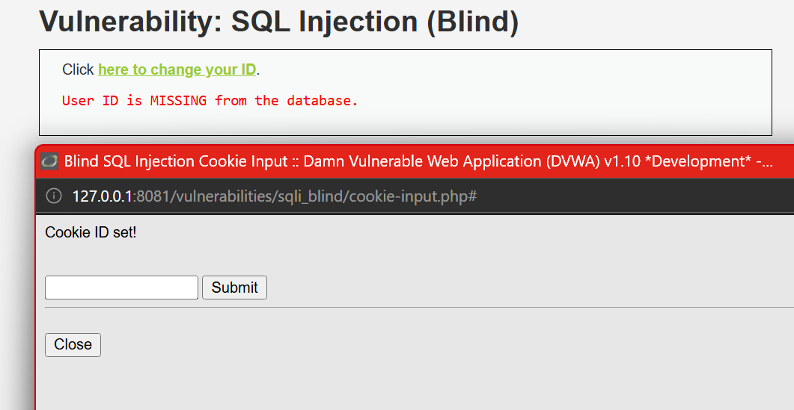

**Defense Mechanism:**
The intended defense was obscuring the input by moving it to a cookie. However the cookie value is still passed unsanitized to the SQL query. Proper prevention requires prepared statements regardless of where input originates.

---

| Field | Details |
|---|---|
| Vulnerability | SQL Injection (Blind) |
| Security Levels Tested | Low, Medium, High |
| Low Payload | `1' AND 1=1#` / `1' AND 1=2#` |
| Medium Payload | `1 AND 1=1` via Burp Suite |
| High Payload | `1' AND 1=1#` via cookie popup |
| Low Result | Boolean response confirmed injection |
| Medium Result | Boolean response confirmed via Burp |
| High Result | Still vulnerable via unsanitized cookie |
| OWASP Category | A03:2021 Injection |

---

### 3.3 XSS Reflected

#### Low

**Payload:** `<script>alert('XSS')</script>`

**Result:**
Alert popup fired with "XSS". The script tag was reflected directly in the page response and executed by the browser.


**Why it worked:**
Input is reflected back in the response with zero sanitization. The browser sees the script tag and executes it immediately.

---

#### Medium

**Payload:** ``

**Result:**
Initial `<script>` payload was stripped and rendered as plain text. The img onerror bypass fired the alert successfully.


**Analysis:**
Medium filters `<script>` tags but does not sanitize other HTML tags. The img onerror attribute executes JavaScript without needing a script tag at all.

---

#### High

**Payload:** ``

**Result:**
Same img onerror bypass worked at High as well. Alert fired successfully. High level did not fully prevent the attack.

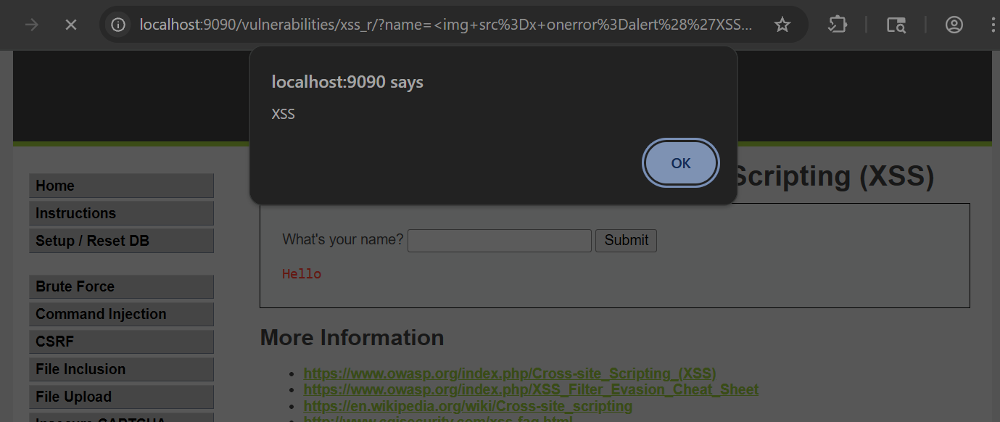

**Defense Mechanism:**
High attempts stricter filtering but still fails to block event-based handlers like onerror. Full prevention requires output encoding — converting special characters to HTML entities so the browser never interprets input as code.

---

| Field | Details |
|---|---|
| Vulnerability | XSS Reflected |
| Security Levels Tested | Low, Medium, High |
| Low Payload | `<script>alert('XSS')</script>` |
| Medium Payload | `` |
| High Payload | `` |
| Low Result | Alert fired |
| Medium Result | Script tag stripped, img bypass worked |
| High Result | Still vulnerable via img onerror |
| OWASP Category | A03:2021 Injection |

---

### 3.4 XSS Stored

#### Low

**Payload:** `<script>alert('Stored XSS')</script>` in the Message field

**Result:**
Alert popup fired with "Stored XSS". The script was saved to the database and executed every time the page loaded. Maxlength attribute on the message field was changed via browser inspect to allow the full payload.


**Why it worked:**
Input is saved to the database with no sanitization and rendered raw on every page load. Any user visiting the page triggers the script automatically.

---

#### Medium

**Payload:** ``

**Result:**
Script tags were stripped but the img onerror bypass fired the alert successfully. Payload was stored and executed on page load.


**Analysis:**
Medium filters `<script>` tags on stored input but ignores other HTML tags and event handlers. The img onerror attribute executes JavaScript without a script tag.

---

#### High

**Payload:** ``

**Result:**
Payload was saved but the message field showed empty. No alert fired. High level stripped the entire payload before storing it in the database.


**Defense Mechanism:**
High level sanitizes input before storing it and encodes output before rendering. Special characters are converted to HTML entities so the browser treats them as text, not code.

---

| Field | Details |
|---|---|
| Vulnerability | XSS Stored |
| Security Levels Tested | Low, Medium, High |
| Low Payload | `<script>alert('Stored XSS')</script>` |
| Medium Payload | `` |
| High Payload | `` |
| Low Result | Alert fired on page load |
| Medium Result | Script stripped, img bypass worked |
| High Result | Payload stripped, no execution |
| OWASP Category | A03:2021 Injection |

---

### 3.5 XSS DOM

#### Low

**Payload:**

```html

```

**Result:**  
[Describe the alert that fired via DOM manipulation.]

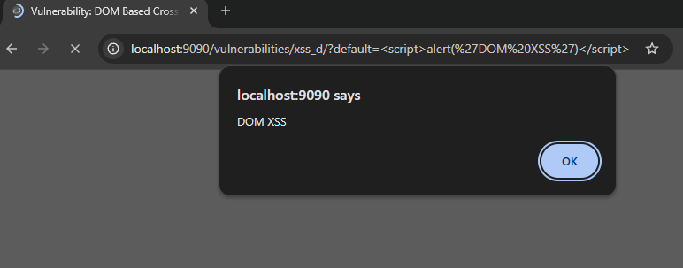

**Why it worked:**  
[Input is written directly into the DOM via JavaScript without sanitization. The browser executes it.]

---

#### Medium

**Payload / Approach:**  
[Describe the bypass attempt.]

**Result:**  
[Describe what happened.]

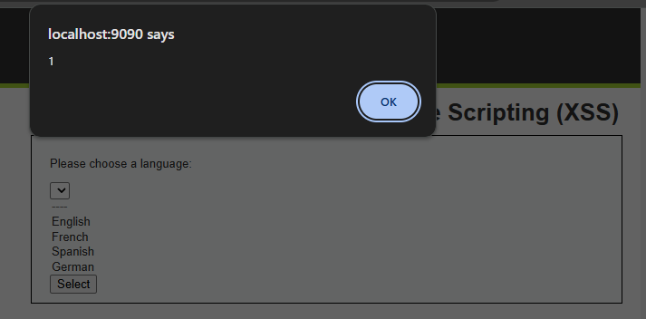

**Analysis:**  
[Explain Medium DOM-based filtering changes.]

---

#### High

**Result:**  
[Describe that it failed.]

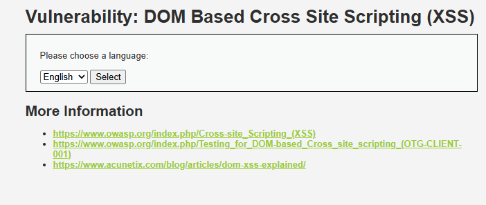

**Defense Mechanism:**  
[Explain High level defense against DOM XSS.]

---

| Field | Details |
|---|---|
| Vulnerability | XSS DOM |
| Security Levels Tested | Low, Medium, High |
| Payload | `` |
| Low Result | [Result] |
| Medium Result | [Result] |
| High Result | [Result] |
| OWASP Category | A03:2021 Injection |

---

### 3.6 CSRF

#### Low

**Approach:**  
Crafted an HTML form that auto-submits a password change request. The browser sends the session cookie automatically.

```html
<form action="http://localhost:8080/vulnerabilities/csrf/" method="GET">
  <input type="hidden" name="password_new" value="hacked">
  <input type="hidden" name="password_conf" value="hacked">
  <input type="hidden" name="Change" value="Change">
</form>
<script>document.forms[0].submit();</script>
```

**Result:**  
[Describe the password change succeeding without user interaction.]

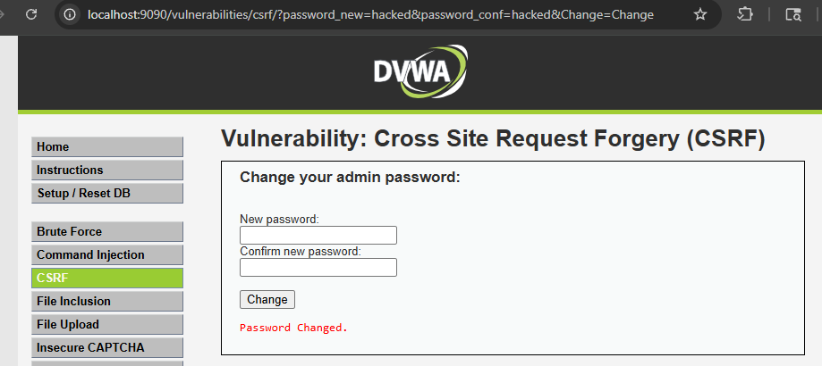

**Why it worked:**  
[No CSRF token is present. Any request with a valid session cookie is accepted regardless of origin.]

---

#### Medium

**Approach:**  
[Describe the Referer header check and whether you attempted to bypass it.]

**Result:**  
[Describe what happened.]

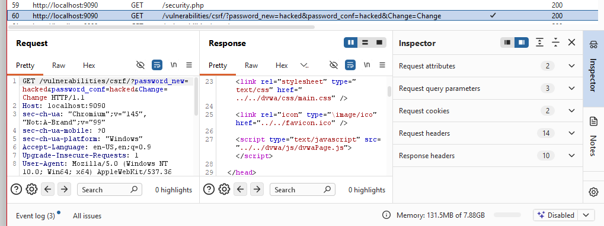

**Analysis:**  
[Medium checks the Referer header. Explain whether this is bypassable and how.]

---

#### High

**Result:**  
[Describe that it failed.]

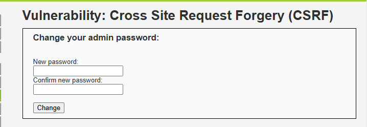

**Defense Mechanism:**  
[High requires a CSRF token embedded in the form. A forged request from another origin cannot know the token, so the server rejects it.]

---

| Field | Details |
|---|---|
| Vulnerability | CSRF |
| Security Levels Tested | Low, Medium, High |
| Payload | Forged HTML form |
| Low Result | [Result] |
| Medium Result | [Result] |
| High Result | [Result] |
| OWASP Category | A01:2021 Broken Access Control |

---

### 3.7 Command Injection

#### Low

**Payload:**

```
127.0.0.1; ls
```

**Result:**  
[Describe both commands executing — ping and ls output visible.]

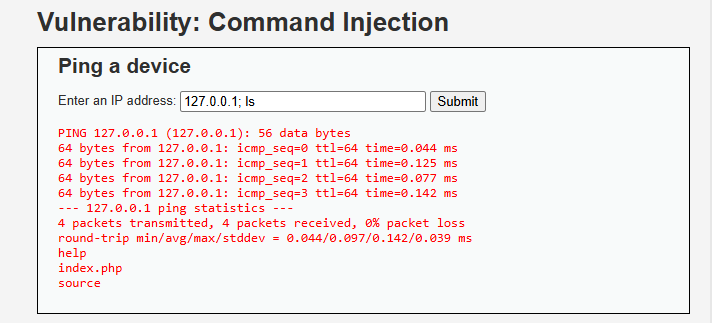

**Why it worked:**  
[Input is passed directly to a system shell call. Shell metacharacters like `;` are not stripped.]

---

#### Medium

**Payload / Approach:**

```
127.0.0.1 && ls
```

**Result:**  
[Describe whether the bypass worked.]

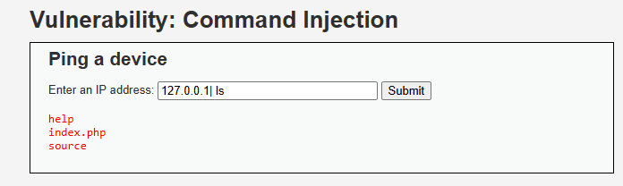

**Analysis:**  
[Medium strips some characters like `;` but misses others like `&&`. Explain which ones worked.]

---

#### High

**Result:**  
[Describe that it failed.]

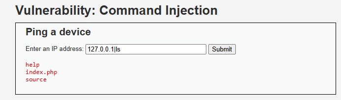

**Defense Mechanism:**  
[High uses a strict character whitelist on input. Shell metacharacters are completely blocked.]

---

| Field | Details |
|---|---|
| Vulnerability | Command Injection |
| Security Levels Tested | Low, Medium, High |
| Payload | `127.0.0.1; ls` |
| Low Result | [Result] |
| Medium Result | [Result] |
| High Result | [Result] |
| OWASP Category | A03:2021 Injection |

---

### 3.8 File Inclusion

#### Low

**Payload:**

```
http://localhost:8080/vulnerabilities/fi/?page=../../etc/passwd
```

**Result:**  
[Describe the /etc/passwd file contents being displayed.]

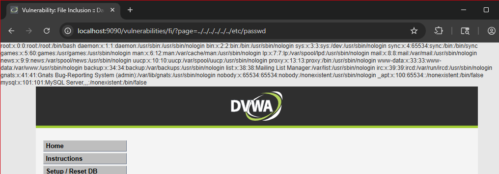

**Why it worked:**  
[The `page` parameter is passed directly to a PHP include statement with no path restriction.]

---

#### Medium

**Payload / Approach:**  
[Describe the bypass attempt — e.g. double encoding or null byte.]

**Result:**  
[Describe what happened.]

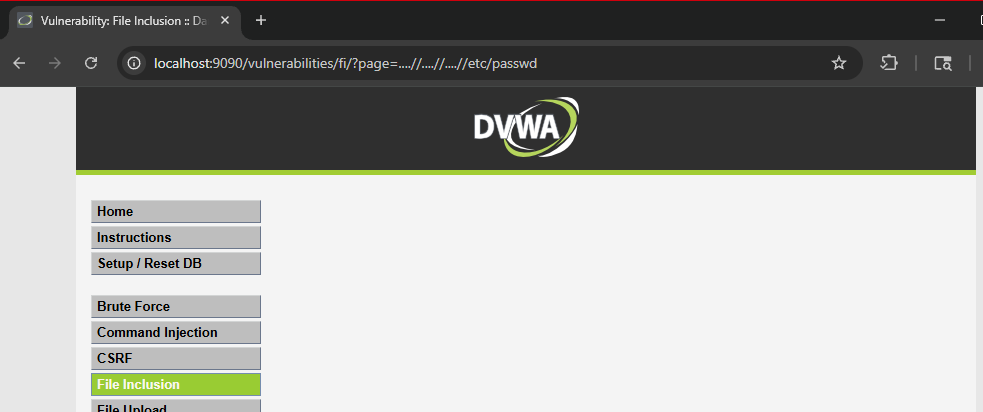

**Analysis:**  
[Medium adds some path restrictions but may still be bypassable. Explain your findings.]

---

#### High

**Result:**  
[Describe that it failed.]

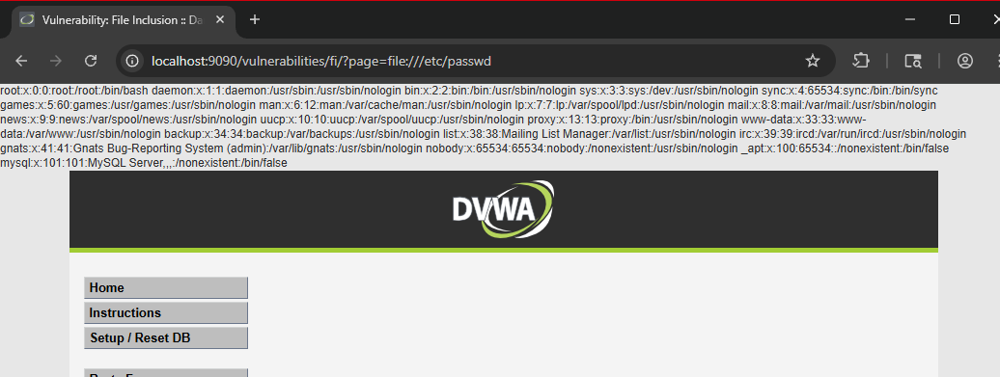

**Defense Mechanism:**  
[High uses a hardcoded allowlist of permitted filenames. Any value outside the allowlist is rejected.]

---

| Field | Details |
|---|---|
| Vulnerability | File Inclusion |
| Security Levels Tested | Low, Medium, High |
| Payload | `../../etc/passwd` |
| Low Result | [Result] |
| Medium Result | [Result] |
| High Result | [Result] |
| OWASP Category | A05:2021 Security Misconfiguration |

---

### 3.9 File Upload

#### Low

**Approach:**  
Uploaded a PHP webshell as a `.php` file with no restrictions.

```php
<?php system($_GET['cmd']); ?>
```

**Result:**  
[Describe the file being accepted and the shell being accessible at its upload path.]

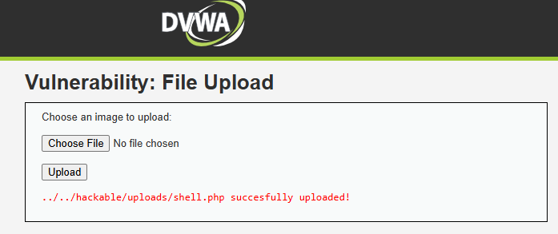

**Why it worked:**  
[No file type validation exists at Low. Any file extension is accepted.]

---

#### Medium

**Approach:**  
[Describe using Burp Suite to intercept and change the Content-Type header from application/x-php to image/jpeg.]

**Result:**  
[Describe whether the bypass worked.]

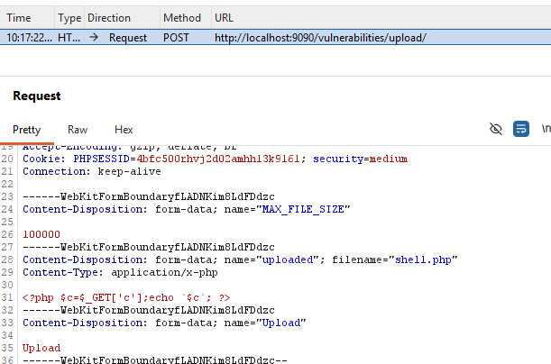

**Analysis:**  
[Medium checks the MIME type sent in the request header, not the actual file content. Changing the header in Burp bypasses this check.]

---

#### High

**Result:**  
[Describe that it failed.]

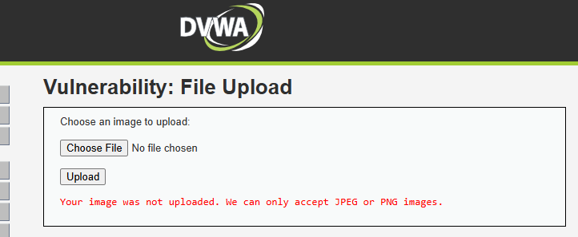

**Defense Mechanism:**  
[High inspects the actual file content and extension. A PHP file masquerading as an image is detected and rejected.]

---

| Field | Details |
|---|---|
| Vulnerability | File Upload |
| Security Levels Tested | Low, Medium, High |
| Payload | PHP webshell |
| Low Result | [Result] |
| Medium Result | [Result] |
| High Result | [Result] |
| OWASP Category | A04:2021 Insecure Design |

---

### 3.10 Brute Force

#### Low

**Approach:**  
Used Burp Suite Intruder or Hydra to automate login attempts against `admin`.

```bash
hydra -l admin -P /path/to/wordlist.txt http-get-form \
"localhost/vulnerabilities/brute/:username=^USER^&password=^PASS^&Login=Login:Username and/or password incorrect."
```

**Result:**  
[Describe credentials found and how long it took.]

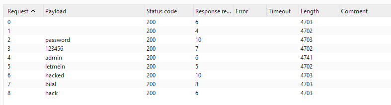

**Why it worked:**  
[No rate limiting, lockout policy, or delay exists at Low. Requests are processed as fast as they arrive.]

---

#### Medium

**Approach:**  
[Describe your approach at Medium.]

**Result:**  
[Describe what changed — e.g. a delay was added.]

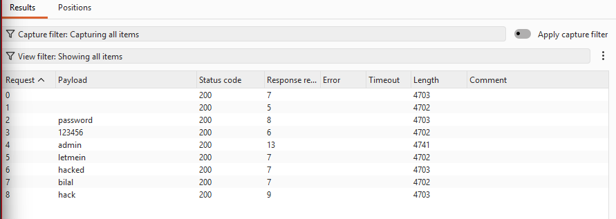

**Analysis:**  
[Explain Medium level changes — e.g. sleep delay added per request, slowing but not stopping brute force.]

---

#### High

**Result:**  
[Describe that automated brute force failed.]

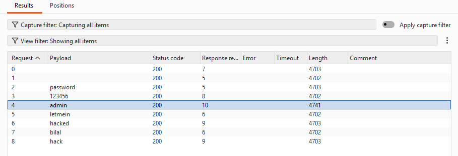

**Defense Mechanism:**  
[High requires a CSRF token that changes with every request. An automated tool cannot retrieve and replay it fast enough, making brute force impractical.]

---

| Field | Details |
|---|---|
| Vulnerability | Brute Force |
| Security Levels Tested | Low, Medium, High |
| Tool Used | Burp Suite Intruder / Hydra |
| Low Result | [Result] |
| Medium Result | [Result] |
| High Result | [Result] |
| OWASP Category | A07:2021 Identification & Authentication Failures |

---

### 3.11 Insecure CAPTCHA

#### Low

**Approach:**  
[Describe how CAPTCHA was bypassed — e.g. parameter manipulation via Burp to skip the CAPTCHA step.]

**Result:**  
[Describe the password change succeeding without solving the CAPTCHA.]


**Why it worked:**  
[CAPTCHA validation is either client-side only or the step parameter can be manipulated to jump directly to the final action without verification.]

---

#### Medium

**Approach:**  
[Describe your approach.]

**Result:**  
[Describe what happened.]


**Analysis:**  
[Explain Medium level change and whether it was still bypassable.]

---

#### High

**Result:**  
[Describe that it failed.]


**Defense Mechanism:**  
[Explain High level server-side CAPTCHA enforcement.]

---

| Field | Details |
|---|---|
| Vulnerability | Insecure CAPTCHA |
| Security Levels Tested | Low, Medium, High |
| Low Result | [Result] |
| Medium Result | [Result] |
| High Result | [Result] |
| OWASP Category | A07:2021 Identification & Authentication Failures |

---

### 3.12 Weak Session IDs

#### Low

**Approach:**  
Clicked "Generate" multiple times and observed the session ID values in the cookie.

**Result:**  
[Describe the sequential IDs observed — 1, 2, 3, etc.]

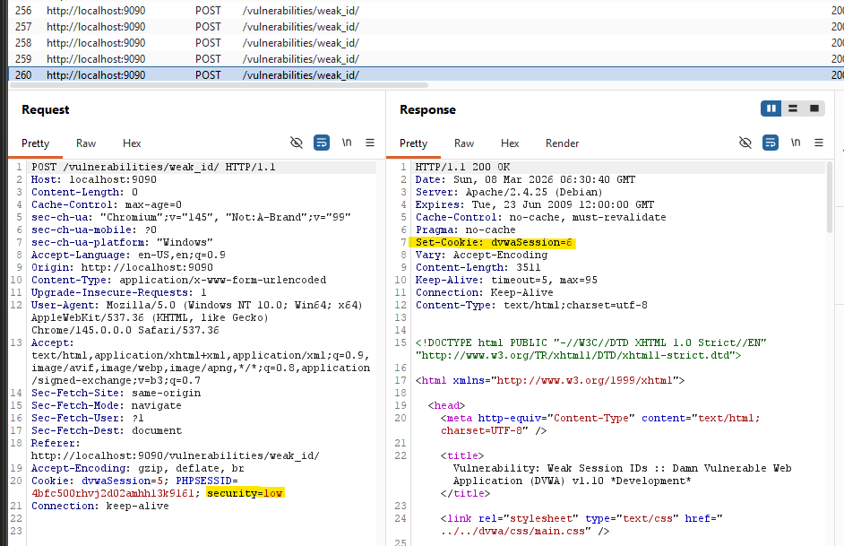

**Why it worked:**  
[Session IDs are generated using a simple counter. They are predictable, making session hijacking trivial.]

---

#### Medium

**Approach:**  
[Describe your observation at Medium.]

**Result:**  
[Describe whether the IDs improved.]

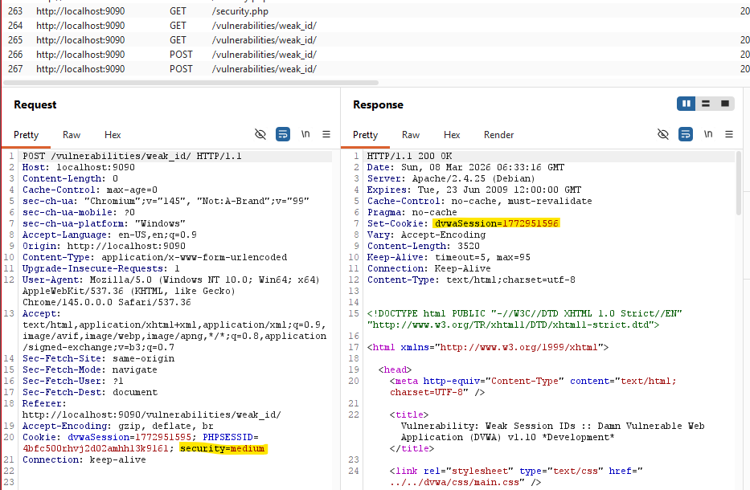

**Analysis:**  
[Explain Medium level session ID generation — e.g. time-based, still somewhat predictable.]

---

#### High

**Result:**  
[Describe the session ID format at High.]

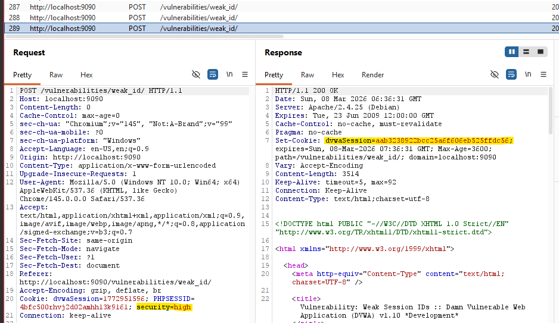

**Defense Mechanism:**  
[High uses a cryptographically secure random value for session IDs. Brute forcing or predicting them is not feasible.]

---

| Field | Details |
|---|---|
| Vulnerability | Weak Session IDs |
| Security Levels Tested | Low, Medium, High |
| Low Result | [Result] |
| Medium Result | [Result] |
| High Result | [Result] |
| OWASP Category | A07:2021 Identification & Authentication Failures |

---

## 4. Security Analysis

### Q1: Why does SQL Injection succeed at Low security?

[User input is directly concatenated into the SQL query with no escaping or parameterization. Explain the vulnerable query structure and how the payload `1' OR '1'='1` breaks out of the intended query logic.]

### Q2: What control prevents SQL Injection at High?

[DVWA uses PDO prepared statements at High. Explain how parameterized queries work — the query structure is fixed at compile time, and user input is always treated as data, never as code.]

### Q3: Does HTTPS prevent these attacks?

[No. HTTPS encrypts data in transit between the client and server. The attacks covered in this lab — SQLi, XSS, CSRF, command injection — all execute at the application layer, after the server has already decrypted the request. HTTPS has no visibility into application logic. A password sent over HTTPS to a vulnerable login form is still vulnerable to SQLi once the server processes it.]

### Q4: What risks exist if DVWA is deployed publicly?

[Cover the following: remote code execution via file upload, full database read/write via SQL injection, session hijacking via weak session IDs, account takeover via CSRF or brute force, phishing and malware distribution via stored XSS, and use of the compromised server as a pivot point for attacking other internal systems.]

### Q5: Why does security increase at each DVWA level?

[Compare the defense strategies used across levels. Low uses no validation. Medium adds partial input filtering, which is often bypassable. High uses proper defenses — prepared statements, output encoding, CSRF tokens, allowlists. The jump from Medium to High reflects the difference between security theater and actual security controls.]

---

## 5. OWASP Top 10 Mapping

| Vulnerability | OWASP Top 10 Category |
|---|---|
| SQL Injection | A03:2021 Injection |
| SQL Injection (Blind) | A03:2021 Injection |
| XSS Reflected | A03:2021 Injection |
| XSS Stored | A03:2021 Injection |
| XSS DOM | A03:2021 Injection |
| CSRF | A01:2021 Broken Access Control |
| Command Injection | A03:2021 Injection |
| File Inclusion | A05:2021 Security Misconfiguration |
| File Upload | A04:2021 Insecure Design |
| Brute Force | A07:2021 Identification & Authentication Failures |
| Insecure CAPTCHA | A07:2021 Identification & Authentication Failures |
| Weak Session IDs | A07:2021 Identification & Authentication Failures |

---

## 6. Bonus: Nginx + HTTPS

### Nginx Reverse Proxy Setup

[Describe your Nginx configuration. Explain how it listens on port 443 and proxies traffic to the DVWA container on port 8080.]

```nginx
[Paste your nginx.conf here]
```


### Self-Signed Certificate

```bash
openssl req -x509 -nodes -days 365 -newkey rsa:2048 \
  -keyout nginx.key -out nginx.crt
```

[Paste openssl output and describe the certificate details.]


### HTTP vs HTTPS Traffic Comparison

[Describe what you captured in Wireshark. On HTTP you can see plaintext credentials in the packet payload. On HTTPS the payload is encrypted and unreadable.]


---

## 7. Conclusion

[Summarize the key takeaways. What did you observe about how defenses evolve from Low to High? What does the failure of partial fixes at Medium tell you about real-world application hardening? What would you recommend if you were auditing a production application?]

---

## 8. GitHub Repository

**Repository:** [https://github.com/yourusername/dvwa-security-lab](https://github.com/yourusername/dvwa-security-lab)

---

*This lab was performed exclusively on a local machine. No external systems were tested or attacked.*
